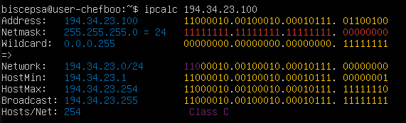
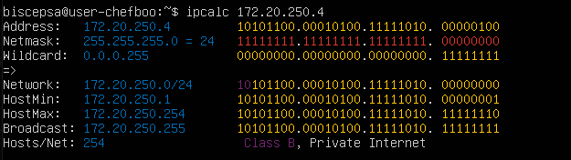
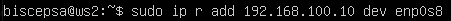
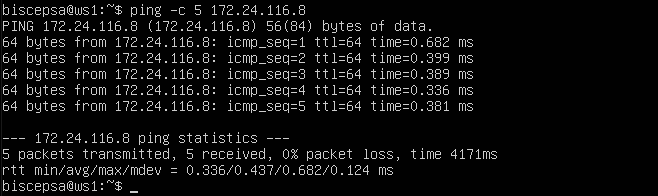
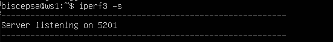
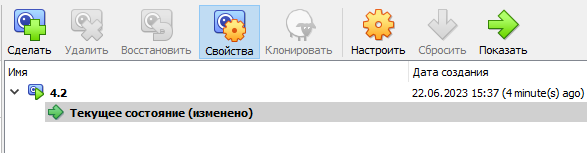
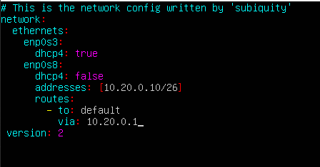
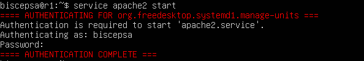

# Сети в Linux

Настройка сетей в Linux на виртуальных машинах.

## Part 1. Инструмент **ipcalc**

__Поднимем виртуальную машину ws1__

  *виртуальная машина ws1* 

Проверим версию системы

  *версия машины ws1* 

Установим **ipcalc**

  *команда установки ipcalc* 

#### 1.1. Сети и маски

1) __адрес сети *192.167.38.54/13*__

      *адрес сети 192.167.38.54/13* 

2) __перевод маски _255.255.255.0_ в префиксную и двоичную запись, _/15_ в обычную и двоичную, _11111111.11111111.11111111.11110000_ в обычную и префиксную__
    
    - перевод маски _255.255.255.0_  в префиксную и двоичную запись
          *в префиксную и двоичную запись* 
    
        Префиксная запись - _/24_ 
        Двоичная запись - _11111111.11111111.11111111. 000000000_
    
    - перевод _/15_ в обычную и двоичную
          *в обычную и двоичную запись* 
    
        Обычная запись - _255.254.0.0_ 
        Двоичная запись - _11111111.11111110.00000000.000000000_
    
    - перевод _11111111.11111111.11111111.11110000_ в обычную и префиксную запись
    
        Для перевода в префиксную запись необходимо посчитать количество ненулевых бит - 28.
    
        Проверим:
    
          */28 в обычную и двоичную запись* 

        Обычная запись - _255.255.255.240_ 
        Префиксная запись - _/28_
    
3) __минимальный и максимальный хост в сети _12.167.38.4_ при масках: _/8_, _11111111.11111111.00000000.00000000_, _255.255.254.0_ и _/4___

    - при маске _/8_
    
          *мин. и макс. хост при маске /8* 
    
    - при маске _11111111.11111111.00000000.00000000_
        Для начала переведем _11111111.11111111.00000000.00000000_ в префиксную запись - _/16_
    
          *мин. и макс. хост при маске /16* 
    
    - при маске _255.255.254.0_
    
          *мин. и макс. хост при маске 255.255.254.0* 
    
    - при маске _/4_
    
          *мин. и макс. хост при маске /4* 
    
#### 1.2. localhost
    
**Определить и записать в отчёт, можно ли обратиться к приложению, работающему на localhost, со следующими IP: _194.34.23.100, 127.0.0.2, 127.1.0.1, 128.0.0.1_**

К приложению, работающему на localhost, можно обратиться, если в _Hosts/Net_ есть _Loopback_.

Нельзя обратиться:

-   *194.34.23.100* 

-   *128.0.0.1* 

Можно обратиться:

-   *127.0.0.2* 

-   *127.1.0.1* 

#### 1.3. Диапазоны и сегменты сетей

1) __какие из перечисленных IP можно использовать в качестве публичного, а какие только в качестве частных: _10.0.0.45, 134.43.0.2, 192.168.4.2, 172.20.250.4, 172.0.2.1, 192.172.0.1, 172.68.0.2, 172.16.255.255, 10.10.10.10, 192.169.168.1___

IP можно использовать в качестве частных, если в _Hosts/Net_ есть _Private Internet_.

К публичным относятся:

-   *134.43.0.2* 

-   *172.0.2.1* 

-   *192.172.0.1* 

-   *172.68.0.2* 

-   *192.169.168.1* 

К частным относятся:

-   *10.0.0.45* 

-   *192.168.4.2* 

-   *172.20.250.4* 

-   *172.16.255.255* 

-   *10.10.10.10* 

2) __какие из перечисленных IP адресов шлюза возможны у сети _10.10.0.0/18: 10.0.0.1, 10.10.0.2, 10.10.10.10, 10.10.100.1, 10.10.1.255___

Смотрим на минимальный и максимальный хост у сети _10.10.0.0/18_.  
Флаг _-b_ позволяет убрать двоичный вывод.

  *10.10.0.0/18* 

Соотвественно, у сети _10.10.0.0/18_ возможны следующие IP адреса: _10.10.0.2, 10.10.10.10, 10.10.1.255_.
    
## Part 2. Статическая маршрутизация между двумя машинами

__Поднимаем две виртуальные машины -- ws1 и ws2__

  ws1 и ws2 

Для удобства сменим _hostname_ у  _ws1_ на _ws1_:

  команда для смены _hostname_ и дальнейшего редактирования 

__С помощью команды `ip a` посмотрим существующие сетевые интерфейсы__

  `ip a` на ws1 

  `ip a` на ws2 

__Описать сетевой интерфейс, соответствующий внутренней сети, на обеих машинах и задать следующие адреса и маски: ws1 - _192.168.100.10_, маска _/16_, ws2 - _172.24.116.8_, маска /_12___

Включаем внутреннюю сеть для маршрутизации между двумя машинами:

  внутренняя сеть на ws1 и ws2 

1. Описание сетевего интерфейса на ws1 - _192.168.100.10_, маска _/16_:

    Открываем файл `etc/netplan/00-installer-config.yaml`  для редактирования

      _команда открытия 00-installer-config.yaml_ на ws1 

      _00-installer-config.yaml_ на ws1 

    Редактируем этот файл:

      _измененный 00-installer-config.yaml_ на ws1 

    Применяем команду `sudo netplan apply` для перезапуска сервиса сети.
    
      `netplan apply` на ws1 
    
2. Описание сетевего интерфейса на ws2 - _172.24.116.8_, маска /_12_:

    Открываем файл `etc/netplan/00-installer-config.yaml`  для редактирования

      _команда открытия 00-installer-config.yaml_ на ws2 

      _измененный 00-installer-config.yaml_ на ws2 

    Применяем команду `sudo netplan apply` для перезапуска сервиса сети.
    
      `netplan apply` на ws2 

Посмотрим существующие сетевые интерфейсы:

  `ip a` после изменений на ws1 

  `ip a` после изменений на ws2 

#### 2.1. Добавление статического маршрута вручную

__Добавить статический маршрут от одной машины до другой и обратно при помощи команды вида ip r add__

  Добавление статического маршрута на ws1 

  Добавление статического маршрута на ws2 

__Пропинговать соединение между машинами__

  Пинг с ws1 на ws2 

  Пинг с ws2 на ws1 
    
####  2.2. Добавление статического маршрута с сохранением

__Перезапустить машины__

Команда на обеих машинах - `sudo reboot`

После перезапуска таблица маршрутизации сбрасывается на обеих машинах.

__Добавить статический маршрут от одной машины до другой с помощью файла _etc/netplan/00-installer-config.yaml___

Редактируем _etc/netplan/00-installer-config.yaml_ на обеих машинах:

  _измененный 00-installer-config.yaml_ на ws1 

  _измененный 00-installer-config.yaml_ на ws2 

Выполнить команду `netplan apply` для перезапуска сервиса сети и __пропингуем соединение между машинами__:

  пинг с ws1 на ws2 

  пинг с ws2 на ws1 

## Part 3. Утилита __iperf3__

#### 3.1. Скорость соединения

__Перевести и записать в отчёт: 8 Mbps в MB/s, 100 MB/s в Kbps, 1 Gbps в Mbps__

- 8 Mbps (мегабит в секуду) = 1 MB/s (мегабайт в секунду)
- 100 MB/s (мегабайт в секунду) = 800 000 Kbps (килобит в секунду)
- 1 Gbps (гигабит в секунду) = 1 000 Mbps (мегабит в секунду)

#### 3.2. Утилита __iperf3__

Устанавливаем утилиту __iperf3__ на ws1 и ws2 командой - `sudo apt install iperf3`

  Установка утилиты __iperf3__ на ws1 

На ws1 запускаем __iperf3__ в режиме сервера: `iperf3 -s`

  запуск __iperf3__ на ws1 

На клиенте ws2 запускаем __iperf3__ с указанием IP сервера к которому подключаемся: 

  запуск __iperf3__ на ws2 для тестирования 

Вывод на ws1:

  измерение скорости на ws1 

## Part 4. Сетевой экран

#### 4.1. Утилита iptables

__Создать файл _/etc/firewall.sh_, имитирующий фаерволл, на ws1 и ws2:__

Создаем файл и открываем его для редактирования:

  команда создания файла _/etc/firewall.sh_ 

__Нужно добавить в файл подряд следующие правила:__

1) __на ws1 применить стратегию когда в начале пишется запрещающее правило, а в конце пишется разрешающее правило (это касается пунктов 4 и 5)__

2)  __на ws2 применить стратегию когда в начале пишется разрешающее правило, а в конце пишется запрещающее правило (это касается пунктов 4 и 5)__

3) __открыть на машинах доступ для порта 22 (ssh) и порта 80 (http)__

4) __запретить echo reply (машина не должна "пинговаться”, т.е. должна быть блокировка на OUTPUT)__

5) __разрешить echo reply (машина должна "пинговаться")__

  файл _/etc/firewall.sh_ на ws1 

  файл _/etc/firewall.sh_ на ws2 

__Запускаем файлы на обеих машинах командами `chmod +x /etc/firewall.sh` и `/etc/firewall.sh`__

  Запускаем файл на ws1 

  Запускаем файл на ws2 

Разница между стратегиями, применёнными в первом и втором файлах:
В утилите iptables правила выполняются сверху вниз. 
На ws1 первым указано запрещающее правило на выход, поэтому она не сможет пропинговать другую машину. 
У ws2 первым указано разрешающее правило, значит она сможет пропинговать другую машину.

  Пингуем с ws1 на ws2 

  Пингуем с ws2 на ws1 

#### 4.2. Утилита __nmap__

__Командой ping найти машину, которая не "пингуется", после чего утилитой nmap показать, что хост машины запущен:__

  Пингуем с ws1 на ws2 

  Пингуем с ws2 на ws1 

ws1 не пингуется, покажем, что хост машины запущен: 

  запуск __nmap__ на ws2 для проверки ws1 

_Проверка_: в выводе nmap должно быть сказано: `Host is up`

Сохранить дампы образов виртуальных машин:

  Сохранение дампов образов  

## Part 5. Статическая маршрутизация сети

Сеть: 

  

__Поднять пять виртуальных машин (3 рабочие станции (ws11, ws21, ws22) и 2 роутера (r1, r2))__

  пять виртуальных машин 

#### 5.1. Настройка адресов машин

Добавляем адаптеры для ws11, ws21, w22

  адаптер для ws11 

  адаптер для ws21 и ws22 

Добавляем адаптеры для r1, r2

  адаптер 2 для r1 

  адаптер 3 для r1 

  адаптер 2 для r2 

  адаптер 3 для r2 

__Настроить конфигурации машин в _etc/netplan/00-installer-config.yaml_ согласно сети на рисунке.__

Редактируем файл _etc/netplan/00-installer-config.yaml_ для каждой машины:

  00-installer-config.yaml ws11 

  00-installer-config.yaml ws21 

  00-installer-config.yaml ws22 

  00-installer-config.yaml r1 

  00-installer-config.yaml r2 

__Перезапускаем сервисы сети командой__ - `sudo netplan apply`

Командой `ip -4 a` проверим, что адрес машин задан верно.

  адрес ws11 

  адрес ws21 

  адрес ws22 

  адрес r1 

  адрес r2 

Пропингуем ws22 с ws21

  пинг ws22 с ws21 

Пропингуем r1 с ws11

  пинг r1 с ws11 

#### 5.2. Включение переадресации IP-адресов.

__Для включения переадресации IP, выполним команду на роутерах:__
`sysctl -w net.ipv4.ip_forward=1`. _При таком подходе переадресация не будет работать после перезагрузки системы._

  включения переадресации на r1 

  включения переадресации на r2 

Откроем файл _/etc/sysctl.conf_ на каждом роутере и добавим в него следующую строку:
`net.ipv4.ip_forward = 1`. _При использовании этого подхода, IP-переадресация включена на постоянной основе._

  файл _/etc/sysctl.conf_  на r1 и r2 

  редактирование _/etc/sysctl.conf_  на r1 и r2 

#### 5.3. Установка маршрута по-умолчанию

__Настроить маршрут по-умолчанию (шлюз) для рабочих станций. Для этого добавить default перед IP роутера в файле конфигураций__

  маршрут по-умолчанию (шлюз) для ws11 

  маршрут по-умолчанию (шлюз) для ws21 

  маршрут по-умолчанию (шлюз) для ws22 

__Вызваем `ip r` и покажем, что добавился маршрут в таблицу маршрутизации__

   `ip r` для ws11 

   `ip r`  для ws21 

   `ip r`  для ws22 

__Пропинговать с ws11 роутер r2 и показать на r2, что пинг доходит. Для этого использовать команду:
`tcpdump -tn -i eth1`__

   пинг r2  с ws11 

Пинг не проходит, потому что r2 не может вернуть ответ, но при этом передача пакетов с ws11 есть.
Запускаем на r2 утилиту __tcpdump__, чтобы прослушать и вывести информацию с каких IP адресов приходят пакеты.

   tcpdump на r2 

#### 5.4. Добавление статических маршрутов
___Добавить в роутеры r1 и r2 статические маршруты в файле конфигураций.__

  статический маршрут на r1 

  статический маршрут на r2 

Перезапустим сервисы сети командой - `sudo netplan apply`

__Вызвем `ip r` и покажем таблицы с маршрутами на обоих роутерах. 
  статический маршрут на r1 

  статический маршрут на r2 

__Запустить команды на ws11:
`ip r list 10.10.0.0/[маска сети]` и `ip r list 0.0.0.0/0`__

  запуск команд на r1 

Для адреса _10.10.0.0/18_ был выбран маршрут, отличный от 0.0.0.0/0 (он попадает под маршрут по-умолчанию). IP-адрес 0.0.0.0/0 действует как резервный, пока не будет назначен действительный маршрутизируемый IP-адрес. Машина ws11 соединена с сетью 10.10.0.0/18 по своему IP-адресу 10.10.0.2, для других адресов используется маршрут по умолчанию - 10.10.0.1.

#### 5.5. Построение списка маршрутизаторов

Установим утилиту __traceroute__

  установка  __traceroute__ на ws11 

__Запустим на r1 команду дампа:__

  запуск команды дампа на r1 

  запуск команды дампа на r1 

__При помощи утилиты traceroute строим список маршрутизаторов на пути от ws11 до ws21__

  строим список маршрутизаторов от ws11 до ws21 

Команда traceroute linux использует UDP пакеты. Она отправляет пакет с TTL=1 и смотрит адрес ответившего узла, дальше TTL=2, TTL=3 и так пока не достигнет цели. Каждый раз отправляется по три пакета и для каждого из них измеряется время прохождения. Когда утилита traceroute получает сообщение от целевого узла о том, что порт недоступен трассировка считается завершенной.

#### 5.6. Использование протокола ICMP при маршрутизации

__Запустить на r1 перехват сетевого трафика, проходящего через eth0 с помощью команды:__
`tcpdump -n -i eth0 icmp`

  Запуск на r1 перехвата сетевого трафика 

__Пропингуем с ws11 несуществующий IP (например, 10.30.0.111) с помощью команды:__
`ping -c 1 10.30.0.111`

  Запуск на r1 перехвата сетевого трафика 

__Сохранить дампы образов виртуальных машин__

  Сохранение дампов образов 

## Part 6. Динамическая настройка IP с помощью DHCP

Установим DHCP сервер на r2 и r1

  Установка DHCP сервера 

__Для r2 настроить в файле _/etc/dhcp/dhcpd.conf_ конфигурацию службы DHCP:__

Откроем файл для редактирования:

  команда для редактирования _/etc/dhcp/dhcpd.conf_ 

  файл _/etc/dhcp/dhcpd.conf_ 

1) __указать адрес маршрутизатора по-умолчанию, DNS-сервер и адрес внутренней сети.__

  измененный файл _/etc/dhcp/dhcpd.conf_ 

2) __в файле _resolv.conf_ прописать nameserver `8.8.8.8`.__

Откроем файл для редактирования:

  команда для редактирования _resolv.conf_ 

  файл  _resolv.conf_ 

  измененный файл  _resolv.conf_ 

__Перезагружаем службу DHCP командой `systemctl restart isc-dhcp-server`.__

  Перезагрузка службы DHCP 

  Статус службы DHCP 

Изменим настройки в файле  _etc/netplan/00-installer-config.yaml_ для ws21, чтобы сделать протокол DHCP активным. 

  _etc/netplan/00-installer-config.yaml_ для ws21 

После чего применим команду для перезагрузки сервисов сети - `sudo netplan apply`

__Машину ws21 перезагружаем при помощи `reboot`__

__Через `ip a` показать, что она получила адрес__

  `ip a`  на ws21 

__Пингуем ws22 с ws21.__

  Пинг ws22 с ws21 

__Указать MAC адрес у ws11, для этого в _etc/netplan/00-installer-config.yaml_ надо добавить строки: macaddress: `10:10:10:10:10:BA`, `dhcp4: true`__

Снова редактируем файл _etc/netplan/00-installer-config.yaml_ для ws11:

  файл _etc/netplan/00-installer-config.yaml_ для ws11 

После применяем команду - `sudo netplan aplly`

Так же добавляем MAC-адресс в адаптер 2:

  MAC-адресс в адаптер 2 для ws11 

__Для r1 настроить аналогично r2, но сделать выдачу адресов с жесткой привязкой к MAC-адресу (ws11). Провести аналогичные тесты__

Откроем файл  _/etc/dhcp/dhcpd.conf_  для редактирования :

  команда для редактирования _/etc/dhcp/dhcpd.conf_ 

  измененный файл _/etc/dhcp/dhcpd.conf_ 

Откроем файл _resolv.conf_ для редактирования:

  команда для редактирования _resolv.conf_ 

  измененный файл  _resolv.conf_ 

__Перезагружаем службу DHCP командой `systemctl restart isc-dhcp-server`.__

  Перезагрузка службы DHCP 

  Статус службы DHCP 

__Машину ws11 перезагружаем при помощи `reboot`__

__Через `ip a` показать, что она получила адрес__

  `ip a`  на ws11 

__Пингуем ws22 с ws21.__

  Пинг ws22 с ws11 

__Запросить с ws21 обновление ip адреса__

Проверяем IP до обновления

  IP адреса ws21 до обновления 

Запросим с ws21 обновление IP-адреса с помощью команды `sudo dhclient -v`

  обновление IP-адреса ws21 

  удаление старого IP-адреса ws21 

__Через `ip a` посмотрим, адреса после обновления__ 
  удаление старого IP-адреса ws21 

Были использованы такие опции DHCP сервера:
- option routers ip-address [, ip-address...]; - адреса шлюзов для клиентской сети. 
- option domain-name-servers ip-address [, ip-address...]; - Список DNS серверов доступных клиенту.

__Сохранить дампы образов виртуальных машин__

  сохранение дампов машин 

## Part 7. NAT

Установим сервер apache2 на r1, r2 и ws22.

  Установка сервера apache2 

__В файле _/etc/apache2/ports.conf_ на ws22 и r1 изменить строку `Listen 80` на `Listen 0.0.0.0:80`, то есть сделать сервер Apache2 общедоступным__

Редактируем файл _/etc/apache2/ports.conf_ на ws22 и r1

  Редактируем файл _/etc/apache2/ports.conf_ 

  измененный файл _/etc/apache2/ports.conf_ на ws22 

  измененный файл _/etc/apache2/ports.conf_ на r1 

__Запустить веб-сервер Apache командой `service apache2 start` на ws22 и r1__

  Запускаем веб-сервер Apache на ws22 

  Запускаем веб-сервер Apache на r1 

__Добавить в фаерволл, созданный по аналогии с фаерволлом из Части 4, на r2 следующие правила:__

1) __удаление правил в таблице filter - `iptables -F`__

2) __удаление правил в таблице "NAT" - `iptables -F -t nat`__

3) __отбрасывать все маршрутизируемые пакеты - `iptables --policy FORWARD DROP`__

Создаем фаерволл и редактируем его на r2:

  Создаем фаерволл на r2 

  Добавляем в фаерволл правила 

__Запускать файл также, как в Части 4__

  _Запускать файл _firewall.sh_ 

__Проверить соединение между ws22 и r1 командой `ping`__

  Пингуем ws22 с r1  

_При запуске файла с этими правилами, ws22 не должна "пинговаться" с r1_

__Добавить в файл ещё одно правило:__

4) __разрешить маршрутизацию всех пакетов протокола ICMP__

  Добавляем 4 правило 

__Запускать файл также, как в Части 4__

  _Запускать файл _firewall.sh_ 

__Проверить соединение между ws22 и r1 командой `ping`__

  Пингуем ws22 с r1  

_При запуске файла с этими правилами, ws22 должна "пинговаться" с r1_

__Добавить в файл ещё два правила:__

5) __включить SNAT, а именно маскирование всех локальных ip из локальной сети, находящейся за r2 (по обозначениям из Части 5 - сеть 10.20.0.0)__
_Совет: стоит подумать о маршрутизации внутренних пакетов, а также внешних пакетов с установленным соединением_

6) __включить DNAT на 8080 порт машины r2 и добавить к веб-серверу Apache, запущенному на ws22, доступ извне сети__
_Совет: стоит учесть, что при попытке подключения возникнет новое tcp-соединение, предназначенное ws22 и 80 порту_

  Добавляем правила 5 и 6 

_Перед тестированием рекомендуется отключить сетевой интерфейс NAT (его наличие можно проверить командой ip a) в VirtualBox, если он включен_

Отключим сетевой интерфейс NAT и проверим:

  проверяем отсутствие сетевого интерфейса NAT 

__Запускать файл также, как в Части 4__

  _Запускать файл _firewall.sh_ 

__Проверить соединение по TCP для SNAT, для этого с ws22 подключиться к серверу Apache на r1 командой:__
`telnet [адрес] [порт]`

Проверить подмену IP-адреса можно с помощью команды tcpdump - пингуем с машины ws22 роутер r1

  Проверим подмену IP-адреса 

  Проверим соединение по TCP для SNAT 

__Проверить соединение по TCP для DNAT, для этого с r1 подключиться к серверу Apache на ws22 командой `telnet` (обращаться по адресу r2 и порту 8080)__

  Проверим соединение по TCP для DNAT 

__Сохранить дампы образов виртуальных машин__

  Сохранение дампов образов 

## Part 8. Дополнительно. Знакомство с SSH Tunnels

__Запустить на r2 фаервол с правилами из Части 7__

  фаервол на r2 

__Запускать файл также, как в Части 4__

  _Запускать файл _firewall.sh_ 

По умолчанию SSH не позволяет переадресовать удаленную часть порта. Необходимо это включить.

Редактируем файл конфигурации:

  Редактируем файл конфигурации 

  Файл конфигурации 

  Измененный файл конфигурации 

Перезагрузим sshd:

  Перезагрузка sshd 

__Запустить веб-сервер Apache на ws22 только на localhost (то есть в файле _/etc/apache2/ports.conf_ изменить строку `Listen 80` на `Listen localhost:80`)__

  файл _/etc/apache2/ports.conf_ на ws22 

  Запуск веб-сервера Apache на ws22  

  Проверка состояния веб-сервера Apache на ws22  

__Воспользоваться Local TCP forwarding с ws21 до ws22, чтобы получить доступ к веб-серверу на ws22 с ws21__

  Local TCP forwarding с ws21 до ws22  

  вывод ws22 с ws21  

__Для проверки, сработало ли подключение в обоих предыдущих пунктах, перейдите во второй терминал (например, клавишами Alt + F2) и выполните команду:__
`telnet 127.0.0.1 [локальный порт]`

Проверка со второго терминала (клавишами Alt + F2):

  Проверка подключения 

__Воспользоваться Remote TCP forwarding c ws11 до ws22, чтобы получить доступ к веб-серверу на ws22 с ws11__

  Remote TCP forwarding c ws11 до ws22 

  вывод ws22 с ws11  

__Для проверки, сработало ли подключение в обоих предыдущих пунктах, перейдите во второй терминал (например, клавишами Alt + F2) и выполните команду:__
`telnet 127.0.0.1 [локальный порт]`

Проверка со второго терминала (клавишами Alt + F2):

  Проверка подключения 

__Сохранить дампы образов виртуальных машин__

  Сохранение дампов образов 

